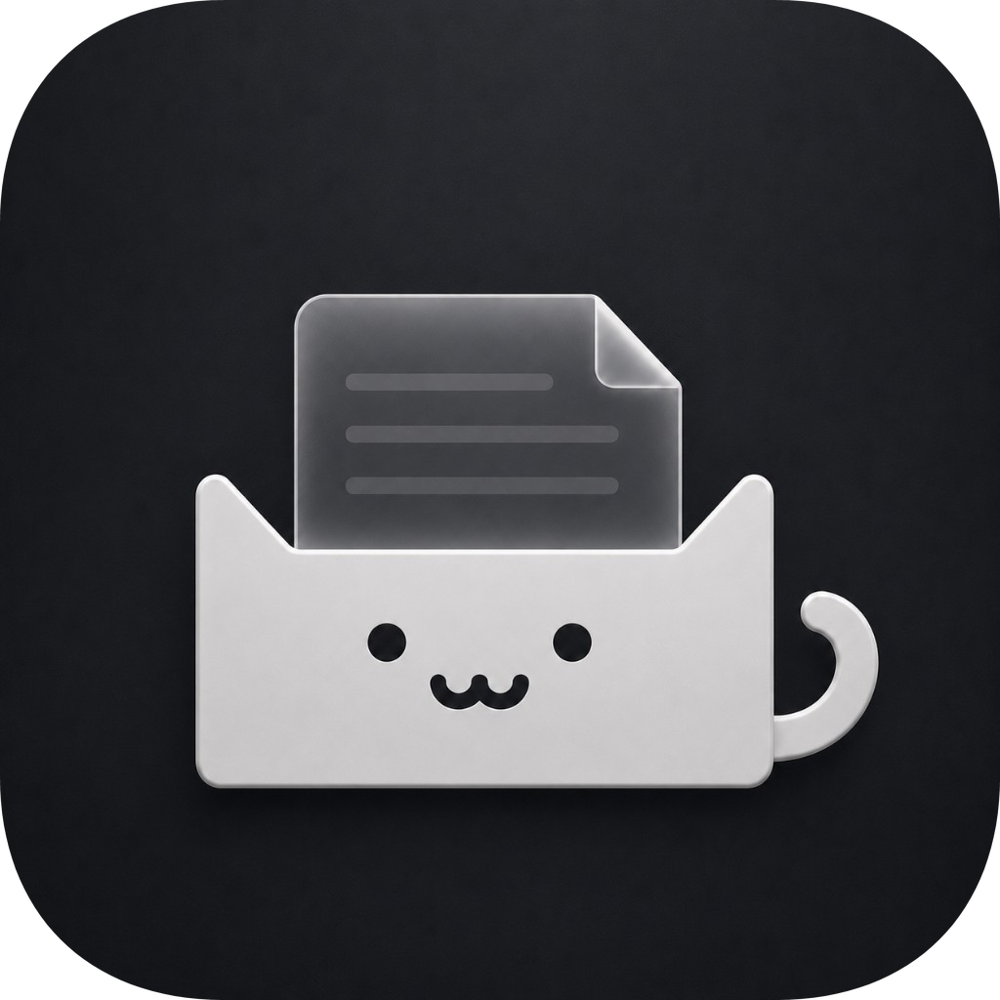
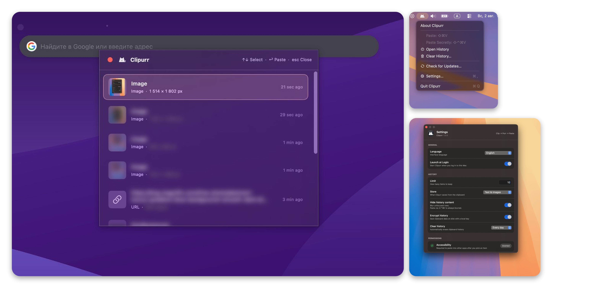

<p align="center">
  
</p>

<h1 align="center">Clipurr</h1>

<p align="center">
  <br>
First local clipboard history for macOS with shoulder-surfing protection.<br>
Like <strong>Win + V</strong>, but better — and built for Mac.<br>
<strong>Clip → Purr → Paste</strong><br>
</p>

<p align="center">
  
  
  
</p>

<p align="center">
  <picture>
    <source media="(prefers-color-scheme: dark)" srcset="docs/screenshots/hero-collage-dark.png">
    
  </picture>
</p>

---

## Features

- **History** — text, links, images, and files, all stored on this Mac
- **Quick paste** — pick an item and paste into the frontmost app
- **Secure Paste** — blurred previews for sensitive content
- **Encryption** — history on disk is sealed with AES-GCM; the key lives in the app’s Application Support folder
- **Settings** — history limit, auto-clear, language, launch at login
- **Privacy** — clipboard history never leaves your Mac (Sparkle only checks for app updates)

## Hotkeys

<p>
  <kbd>⇧</kbd> <kbd>⌘</kbd> <kbd>V</kbd>
  &nbsp;— Open history and paste
</p>
<p>
  <kbd>⇧</kbd> <kbd>⌃</kbd> <kbd>⌘</kbd> <kbd>V</kbd>
  &nbsp;— Secure Paste (blurred previews)
</p>

## Install

1. Download `Clipurr-*.dmg` from [Releases](https://github.com/iddqdidkfaidclip/Clipurr-clipboard-manager/releases)
2. Drag **Clipurr** into Applications
3. First launch: right-click the app → **Open** (macOS Gatekeeper — normal for apps outside the App Store)
4. Grant **Accessibility** when asked — needed for auto-paste

That’s it. No App Store, no paid Apple Developer account required for users.

## Build

```bash
# XcodeGen → Xcode
xcodegen generate
open Clipurr.xcodeproj

# Free signing cert once (so Accessibility works in downloaded DMGs), then package:
./scripts/create-self-signed-cert.sh
./scripts/package-dmg.sh
```

For GitHub Actions releases, create the cert once and store it as repo secrets:

```bash
./scripts/create-self-signed-cert.sh --print-secrets
gh secret set MACOS_CERTIFICATE_PWD --body "$(cat packaging/signing/ClipurrRelease.password)"
gh secret set MACOS_CERTIFICATE < <(base64 < packaging/signing/ClipurrRelease.p12 | tr -d '\n')
```

Auto-updates use [Sparkle](https://sparkle-project.org/). One-time EdDSA key + Pages:

```bash
# Private key lives in packaging/signing/ (gitignored). Public key is in project.yml.
gh secret set SPARKLE_PRIVATE_KEY < packaging/signing/sparkle_eddsa_private.key
# Feed URL: https://iddqdidkfaidclip.github.io/Clipurr-clipboard-manager/appcast.xml
# (CI enables GitHub Pages from /docs and refreshes docs/appcast.xml on each v* tag.)
```

Bump `MARKETING_VERSION` and `CURRENT_PROJECT_VERSION` in `project.yml` before tagging.

Requires [Xcode](https://developer.apple.com/xcode/) 16+ and [create-dmg](https://github.com/create-dmg/create-dmg) (`brew install create-dmg`).

## License

[MIT](LICENSE) — free to use, modify, and distribute.
